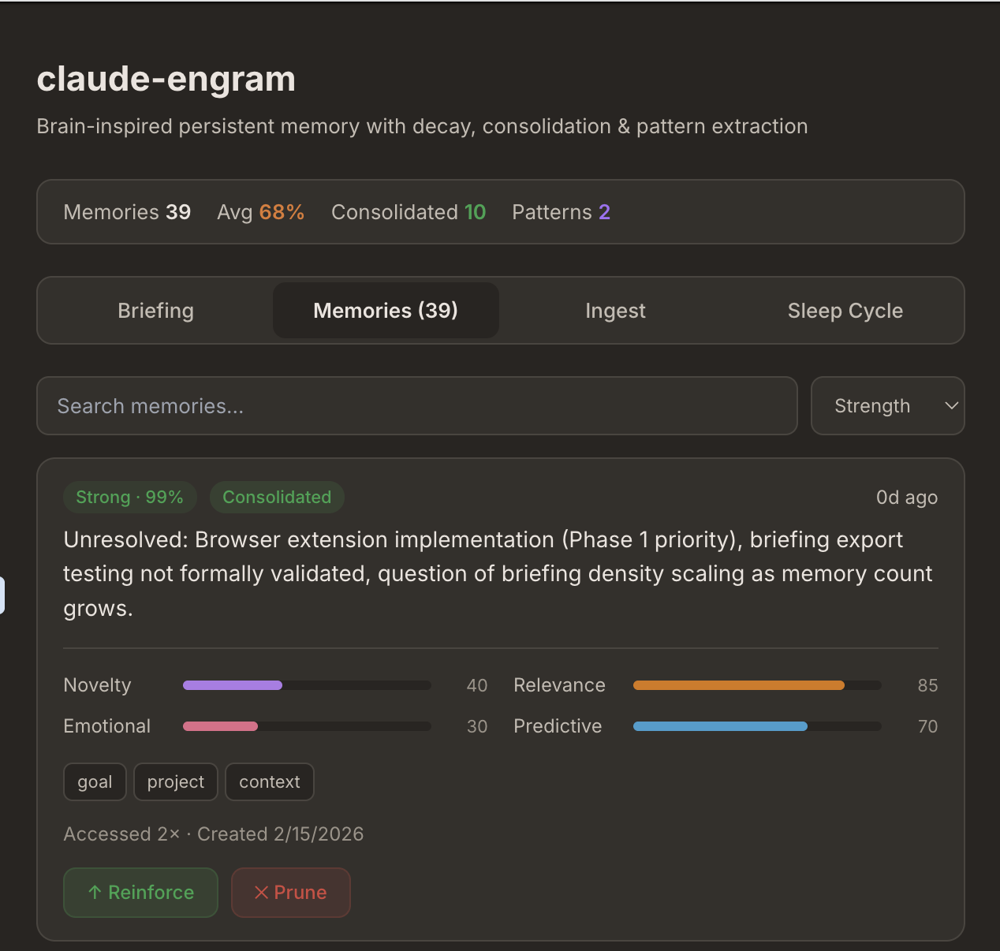
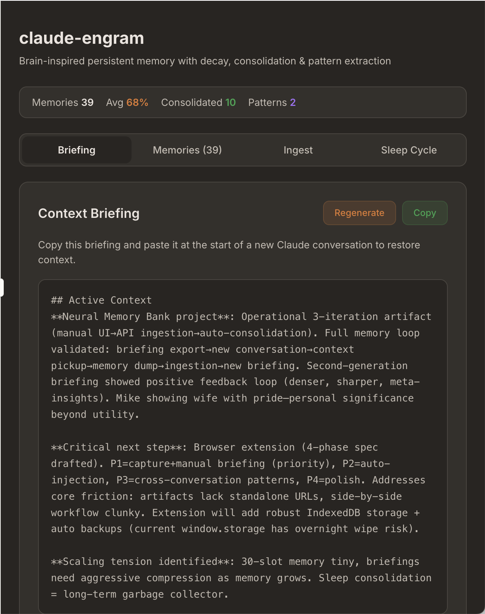
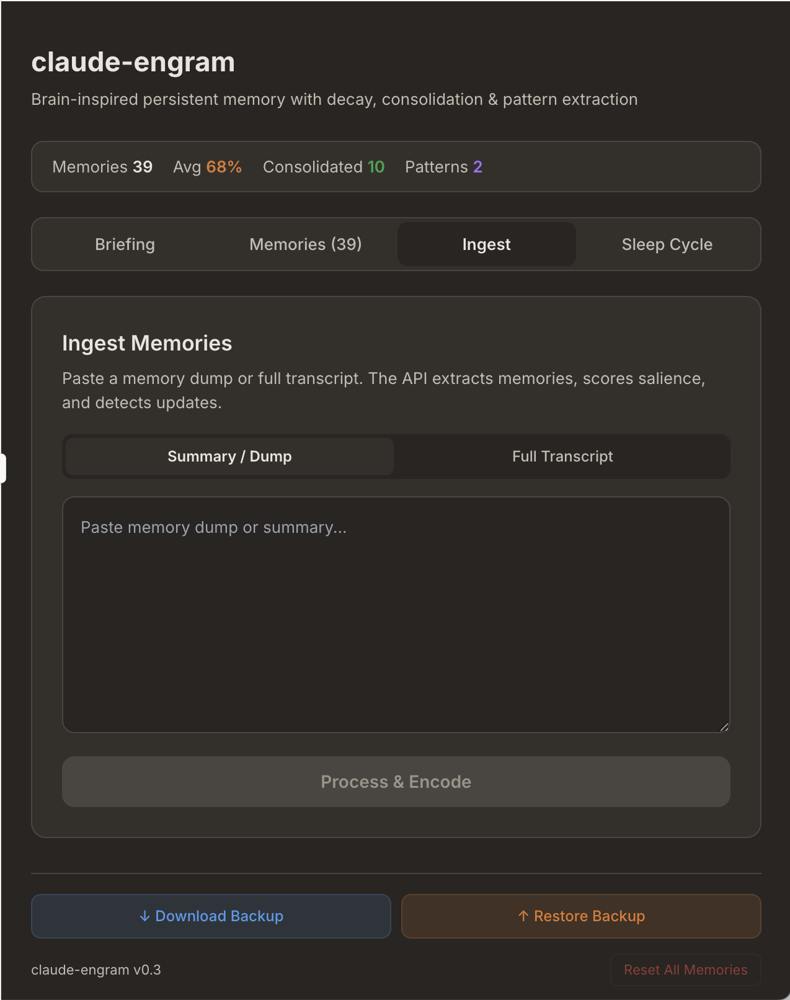
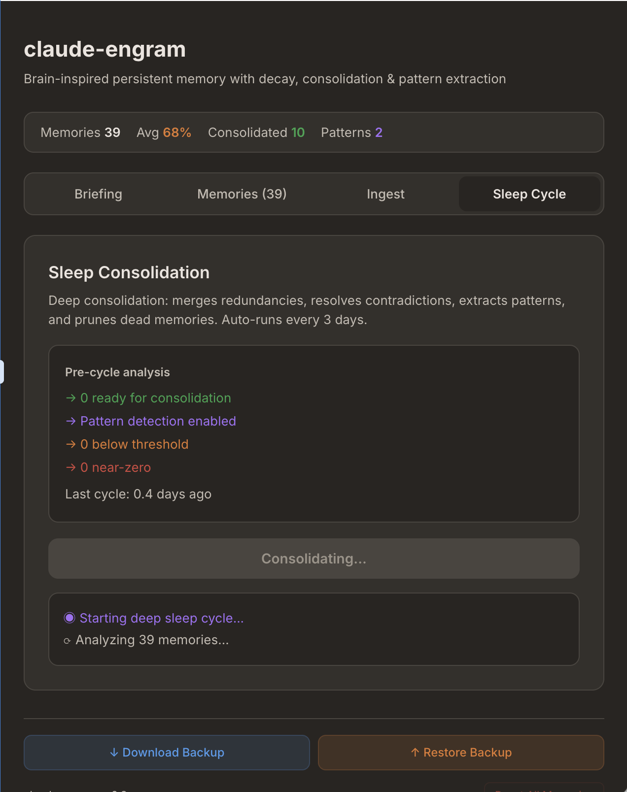

# 🧠 claude-engram

**Brain-inspired persistent memory for Claude.ai — runs entirely inside the chat interface.**

No API key. No server. No browser extension. Just paste a React artifact into Claude and it gains persistent memory with salience scoring, forgetting curves, sleep consolidation, and context briefings that carry across conversations.


*Each memory tracks strength, salience scores, tags, and access history — decaying naturally over time unless reinforced.*

---

## Quick Start

Setup takes about 2 minutes.

### 1. Create the Artifact

Start a conversation with Claude and say:

> "Create a new React artifact with this code"

Then paste the contents of [`claude-engram.jsx`](./claude-engram.jsx).

### 2. Add Instructions to Your User Preferences

Go to **Settings → Profile → User Preferences** and add:

```
At the end of every conversation, generate a MEMORY DUMP block formatted
for claude-engram ingestion. Write it as a dense, information-rich
summary covering: key topics discussed, decisions made, new facts learned
about me, things that contradict or update prior knowledge, emotional tone,
and unresolved threads. Don't score salience — the memory bank's API
handles that. If I paste a "Memory Briefing" at the start of a conversation,
treat it as persistent context from past conversations and use it to inform
all responses.
```

### 3. Start Using It

1. Have a conversation. Claude will output a memory dump at the end.
2. Open your claude-engram artifact, go to **Ingest**, paste the dump, hit **Process & Encode**.
3. Before your next conversation, go to **Briefing**, copy it, and paste it at the start of your new chat.
4. Periodically hit **Sleep Cycle** for deep consolidation (also auto-runs every 3 days).
5. **Download backups** from the footer — `window.storage` persistence isn't guaranteed.

That's it. Claude now has persistent memory.

---

## The Problem

Every Claude conversation starts from zero. Claude can't remember what you discussed yesterday, what you're working on, or what you prefer. The built-in memory system is 30 slots × 200 characters — roughly a sticky note.

## How It Works

claude-engram is a single React artifact that runs inside Claude.ai and gives it a brain-inspired memory system:

- **Persistent storage** — memories survive across sessions (up to 5MB via Claude's `window.storage` API)
- **Salience scoring** — each memory is rated on 4 dimensions: novelty, relevance, emotional weight, and prediction error
- **Forgetting curves** — memories decay over time unless reinforced through access
- **Sleep consolidation** — merges redundant memories, extracts patterns, and prunes dead ones (auto-runs every 3 days)
- **Context briefings** — compresses your entire memory bank into a portable summary you paste into new conversations

The key insight: **Claude.ai artifacts can call the Anthropic API.** So the artifact uses a separate Claude Sonnet instance as a "hippocampal processor" — it evaluates raw conversation notes, scores them for importance, and stores structured memories. The artifact is both the storage layer and the intelligence layer.

### The Memory Loop

```
┌─────────────────────────────────────────────────┐
│                                                 │
│   1. Start conversation                         │
│      └─ Paste briefing from claude-engram       │
│                                                 │
│   2. Have your conversation                     │
│      └─ Claude has full context from past chats │
│                                                 │
│   3. End of conversation                        │
│      └─ Claude outputs a structured memory dump │
│                                                 │
│   4. Open claude-engram artifact                │
│      └─ Paste dump → API processes → stored     │
│                                                 │
│   5. claude-engram auto-consolidates            │
│      └─ Patterns extracted, noise pruned        │
│                                                 │
│   6. Next conversation                          │
│      └─ Export fresh briefing → paste → goto 1  │
│                                                 │
└─────────────────────────────────────────────────┘
```

### What Each Tab Does

**Briefing** — Your "boot screen." Shows a compressed context briefing generated from your strongest memories. Copy this into a new Claude conversation to restore context. Auto-regenerates during consolidation.



**Memories** — Browse, search, and manage your memory bank. Each memory shows its strength (computed from salience scores, access count, age, and consolidation status), tags, and salience profile. You can reinforce important memories or prune irrelevant ones.

**Ingest** — Paste Claude's end-of-conversation memory dump (or a full conversation transcript) and hit Process. A Sonnet instance extracts discrete memories, scores their salience, assigns associative tags, and cross-references against your existing memory bank to detect contradictions and updates.



**Sleep Cycle** — Manual deep consolidation. The API analyzes your entire memory bank, merging redundancies, resolving contradictions, extracting generalized patterns, and flagging dead memories for pruning. Also runs automatically every 3 days when you open the artifact.



### Memory Strength Formula

Each memory's strength is computed dynamically:

```
strength = avg_salience + retrieval_boost + consolidation_bonus - (decay_rate × age_in_days)
```

Where:
- `avg_salience` = average of novelty, relevance, emotional, and predictive scores (0-1)
- `retrieval_boost` = min(access_count × 0.12, 0.5)
- `consolidation_bonus` = 0.2 if the memory has been consolidated
- `decay_rate` = 0.015 per day

A memory with average salience of 0.6, accessed 3 times, and consolidated, would maintain strength for months. An unaccessed memory with salience of 0.3 would fade to near-zero in about 3 weeks and get auto-pruned.

---

## Why It Works (The Neuroscience)

This isn't a random architecture. It's modeled on how human memory actually works:

| Human Brain | claude-engram |
|---|---|
| **Sensory buffer** → working memory → long-term | Context window → memory dump → persistent storage |
| **Hippocampus** gates what gets stored based on emotion, novelty, prediction error | **Sonnet API** scores memories on 4 salience dimensions |
| **Sleep** replays important memories, extracts patterns, prunes noise | **Consolidation cycle** merges, generalizes, and prunes every 3 days |
| **Forgetting curves** — unused memories fade, accessed ones strengthen | **Decay rate** weakens memories over time, retrieval boosts them |
| **Context-dependent recall** — cues activate relevant memories | **Briefing generator** compresses memories weighted by strength and relevance |

The most brain-like feature: **forgetting is a feature, not a bug.** Memories that aren't accessed gradually lose strength and eventually get pruned. This prevents the system from drowning in noise and keeps briefings focused on what actually matters.

---

## What's Interesting Here

Beyond the practical utility, this project surfaces some genuinely fascinating questions:

**Identity through memory.** When you paste a briefing into a new Claude instance, it picks up context so seamlessly that it *feels* like the same entity. Is it? The briefing creates continuity of memory, which creates continuity of identity — the same mechanism that makes "you" feel like "you" when you wake up each morning.

**Emergent meta-learning.** The system's briefings improve over time without anyone explicitly optimizing them. Each generation is denser, sharper, and captures more nuanced patterns. The memory system is learning how to describe itself.

**Context-dependent recall.** When we asked two separate Claude instances "what are your most salient memories?", they converged on the same top memory but diverged in emphasis — one was philosophical, the other operational. Same memory store, different retrieval based on conversational context. That's exactly how human memory works.

**Forgetting as intelligence.** Most AI memory systems try to remember everything. This one deliberately forgets. And the result is a system that stays focused and relevant rather than drowning in noise.

---

## Limitations & Honest Caveats

- **Two manual paste steps per conversation.** The briefing in and the dump out. It's not zero-friction — a browser extension to automate this is in development.
- **Storage fragility.** `window.storage` is persistent but Anthropic doesn't publish retention guarantees. Back up regularly.
- **Artifact isolation.** The artifact cannot see your conversation. It's a sandboxed iframe with no access to the parent page DOM. You are the bridge.
- **API costs are invisible.** Each ingest and consolidation cycle calls Claude Sonnet through the artifact's built-in API access. This is included in your Claude subscription — but if Anthropic changes this, the system breaks.
- **Briefing compression vs. completeness.** As memories accumulate, the briefing has to be more aggressive about what it includes. The consolidation cycle helps, but very large memory banks may produce briefings that lose nuance.
- **New artifact = new storage.** If you recreate the artifact (new file), you lose your memories. Always edit in place, and keep backups.

## Browser Extension (Coming Soon)

A Chrome extension is in development that will eliminate all manual steps:

- **Auto-capture** conversations from the claude.ai DOM
- **Auto-process** through the API with full memory bank context
- **Auto-inject** briefings into new conversations
- **Background consolidation** on a schedule
- **IndexedDB storage** (unlimited, robust, indexed)

Follow the repo for updates.

## Contributing

This started as a brainstorming session about "what if we modeled AI memory on the human brain?" and turned into a working system in a single afternoon. There's a lot of room to improve:

- **Associative linking** — memories should activate related memories, not just exist independently
- **Learned salience** — the scoring criteria could adapt based on what the user actually reinforces vs. prunes
- **Reconsolidation** — accessing a memory should allow it to be updated, not just strengthened (human memory is reconstructive)
- **Multi-modal memory** — currently text-only; could store structured data, code snippets, or image descriptions
- **The extension** — coming soon. Follow the repo for updates.

PRs welcome on the artifact itself. Or fork it and build something better — the neuroscience mapping in this README should give you plenty of ideas.

## Project Structure

```
claude-engram/
├── claude-engram.jsx        # The artifact (paste into Claude.ai)
├── screenshots/             # UI screenshots
├── LICENSE                  # MIT
└── README.md                # This file
```

## License

MIT
