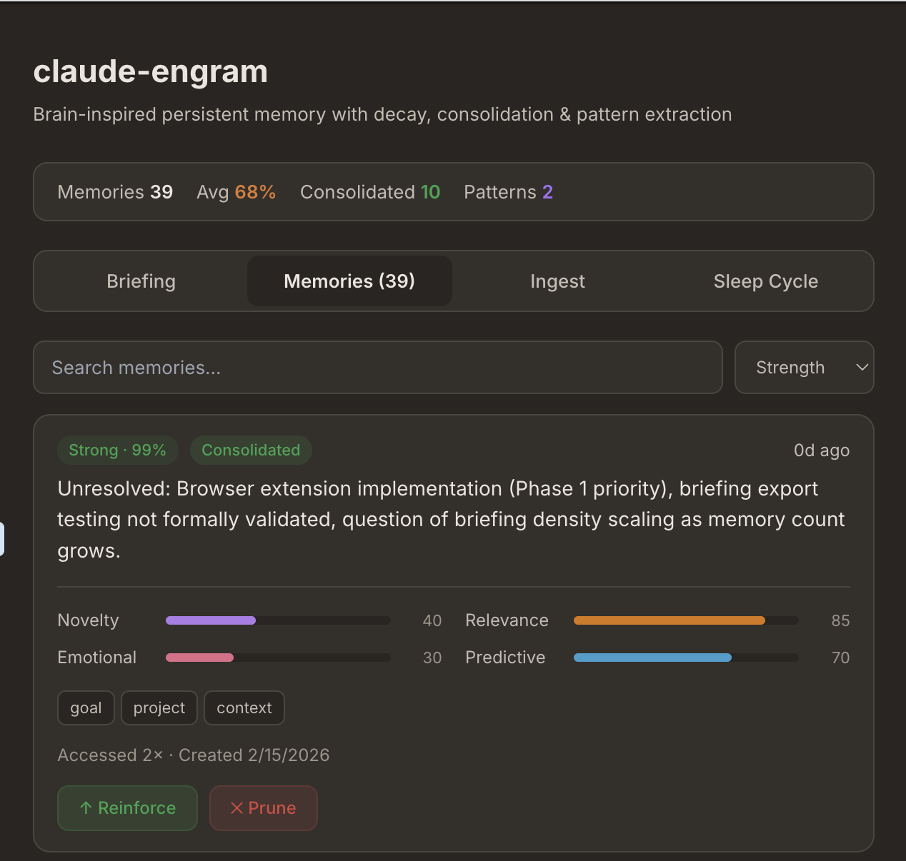

# claude-engram

**Brain-inspired persistent memory for Claude.** Salience scoring, forgetting curves, sleep consolidation, and context briefings — modeled on human hippocampal memory formation.

Two implementations:
- **[v4: Claude Code](#v4-claude-code)** — Fully automatic via hooks + MCP. Zero manual steps. Memory capture, context restoration, consolidation, and active recall happen invisibly.
- **[v1: Claude.ai Artifact](#v1-claudeai-artifact)** — The original. A single React artifact you paste into Claude.ai. Manual but works without an API key or any external tools.

---

## v4: Claude Code

Persistent memory that works automatically with [Claude Code](https://docs.anthropic.com/en/docs/claude-code). Hooks fire at key lifecycle points — capturing memories, restoring context, and preserving state before compaction. An MCP server gives Claude active memory access mid-conversation.

### Installation

**Prerequisites:** [bun](https://bun.sh), an [Anthropic API key](https://console.anthropic.com/settings/keys)

```bash
git clone https://github.com/mlapeter/claude-engram.git
cd claude-engram

# Add your API key to your shell profile (~/.zshrc or ~/.bashrc)
echo 'export ANTHROPIC_API_KEY=your-key-here' >> ~/.zshrc
source ~/.zshrc

# Install, register hooks, and set up MCP server
./install.sh
```

Restart Claude Code. That's it — memory capture starts automatically.

### How It Works

#### Hooks (Passive — Automatic)

Four hooks run at different points in the Claude Code lifecycle:

1. **SessionStart** — Loads your strongest memories, generates a context briefing via Sonnet, and injects it so Claude starts every session knowing who you are and what you've been working on. Also triggers auto-consolidation when due.
2. **Stop** (async) — After each Claude response, reads new transcript content and sends it to Haiku for memory extraction. Uses a capped dedup window (recent + session + strongest memories) instead of the full bank to keep extraction fast at scale. Runs in the background — doesn't slow anything down.
3. **PreCompact** — Fires before Claude Code compresses your context window. Extracts memories from content about to be lost and injects a mini-briefing so Claude retains key context post-compaction.
4. **SessionEnd** — Safety net that captures anything the Stop hook missed before the session closes.

```
Session Start          During Session         Pre-Compact           Session End
     │                      │                      │                     │
     ▼                      ▼                      ▼                     ▼
Load memories         Read new transcript    Save pre-compact      Catch remaining
Generate briefing ──► Extract via Haiku ──►  memories, inject ──►  Extract & store
Inject as context     Store memories         mini-briefing         Reset cursor
Auto-consolidate?
```

#### MCP Server (Active — On Demand)

The MCP server exposes 7 tools that Claude can use mid-conversation:

| Tool | Description |
|---|---|
| `engram_status` | Health overview: counts, strength distribution, consolidation status |
| `engram_recall` | Search memories by text query, ranked by relevance × strength |
| `engram_search_by_tag` | Find memories by tag (OR logic) |
| `engram_reinforce` | Strengthen a memory (Hebbian learning — accessed memories get stronger) |
| `engram_store` | Immediately store something important without waiting for the Stop hook |
| `engram_forget` | Remove a wrong or outdated memory |
| `engram_consolidate` | Run a full sleep consolidation cycle on demand |

When you ask Claude "what do you remember about X?", it can actively search your memories rather than relying only on the session-start briefing.

### Brain-Inspired Features (v5)

Five features modeled directly on neuroscience research:

**Proactive Interference** — When a new memory updates an old one, the old trace's salience is immediately dampened (×0.7). Models how the brain inhibits competing memory traces during encoding rather than waiting for consolidation.

**Episodic→Semantic Degradation** — New memories start as "episodic" (detailed, contextual). After 7+ days, consolidation compresses them to "semantic" (gist only) via Haiku. This is [Fuzzy Trace Theory](https://en.wikipedia.org/wiki/Fuzzy-trace_theory) — you forget the exact words but retain the meaning. Merged and generalized memories are always semantic.

**Temporal Associations** — Recalling a memory also surfaces other memories formed in the same session. Models [temporal contiguity](https://en.wikipedia.org/wiki/Contiguity) — the brain's strongest association mechanism. Searching for "TypeScript config" might also surface "switched to ESM" if both were discussed in the same session.

**Learned Salience** — Every reinforce, forget, and prune emits a salience signal. After 50+ signals, per-dimension weights (0.5–1.5) adapt and calibrate future extraction. If you consistently reinforce memories with high emotional salience and prune ones with high novelty, the system learns to weight emotional content higher. Models VTA dopamine adaptation.

**Context-Adaptive Briefing** — When starting a session, project-scoped memories get a 1.3× boost in the briefing sort order (doesn't change stored values). Sonnet also receives the project name for context. Models context-dependent retrieval — walking into your kitchen activates cooking memories.

### Journey of a Memory

Say you're talking to Claude about your daughter Emma struggling with math. Here's what happens behind the scenes:

**Session 1** — You mention Emma is in 3rd grade and came home upset because she couldn't keep up with multiplication tables. The Stop hook fires, Haiku extracts an episodic memory: *"Emma (8, 3rd grade) struggling with multiplication tables — came home upset, feels behind classmates."* It scores high on emotional salience (0.8) and gets stored.

**Session 3** — You mention Emma's teacher recommended extra practice and that you've been doing flashcards at bedtime. Haiku extracts another memory. Now there are two overlapping episodic memories about Emma and math.

**Session 7** — You ask Claude for advice about math anxiety in kids. The `recall` tool fires, surfaces both Emma memories via fuzzy search, and also pulls in **temporal associations** — other memories from those same sessions (maybe a project you were working on that day). Each recall bumps `access_count`, making the memories stronger. The `reinforce` signals start training the salience weights: *this user cares about emotional/family content*.

**Day 10 — Consolidation runs.** Sonnet sees the two overlapping memories and merges them: *"Emma (8, 3rd grade) struggling with multiplication — feels behind classmates. Teacher recommended extra practice; doing flashcards at bedtime."* One clean semantic memory instead of two redundant episodic ones. Average strength goes up.

**Day 14 — Episodic→Semantic promotion.** Any surviving episodic details older than 7 days get compressed to gist by Haiku. The specific timestamps and session context fade, but the meaning is preserved.

**Next month** — You start a fresh Claude Code session. The SessionStart hook generates a briefing. Because of high emotional salience and multiple reinforcements, Emma's memory has strength near 1.0 — it makes the cut for the top 60 memories. Claude starts the session already knowing about Emma and math, without you ever mentioning it again.

That's the full hippocampal loop: **encode → store → reinforce → consolidate → retrieve.**

### Consolidation ("Sleep Cycle")

The consolidation engine sends your full memory bank to Sonnet for intelligent optimization:

- **Promote** episodic memories older than 7 days to semantic gist (Haiku compression)
- **Merge** redundant memories (e.g., two memories about the same topic → one combined memory)
- **Resolve contradictions** (keeps the newest information)
- **Extract patterns** (recurring themes across 3+ memories become generalized memories)
- **Prune** trivial or fully superseded memories
- **Auto-prune** any memories that have decayed below 0.03 strength

Auto-consolidation triggers on SessionStart when you have >50 memories and >3 days since the last consolidation. It runs asynchronously — doesn't block your session. You can also trigger it manually via the MCP `consolidate` tool.

Above 100 memories, consolidation uses a **two-pass** approach: Haiku identifies merge candidate groups cheaply, then Sonnet only processes the flagged groups — dramatically reducing cost and context size at scale.

### Memory Scoping

- **Global** (`~/.claude-engram/global/`) — Identity, preferences, patterns. Tagged with `identity`, `preference`, `relationship`, `goal`, `personal`. Follows you across all projects.
- **Project** (`~/.claude-engram/projects/<hash>/`) — Technical details, project context. Tagged with `project`, `technical`, `context`. Scoped per working directory.

Both stores are loaded for every briefing, so Claude always has full context regardless of which project you're in.

### Configuration

Optional overrides in `~/.claude-engram/config.json`:

```json
{
  "decayRate": 0.015,
  "retrievalBoost": 0.12,
  "maxRetrievalBonus": 0.5,
  "consolidationBonus": 0.2,
  "autoConsolidationMinMemories": 50,
  "autoConsolidationMinDays": 3,
  "pruneThreshold": 0.03,
  "extractionModel": "claude-haiku-4-5",
  "briefingModel": "claude-sonnet-4-5",
  "consolidationModel": "claude-sonnet-4-5",
  "briefingMaxMemories": 60,
  "maxBackups": 5,
  "interferenceFactor": 0.7,
  "consolidationBatchThreshold": 100
}
```

All values have sensible defaults — you only need this file if you want to tune something.

### Data Directory

```
~/.claude-engram/
├── global/
│   ├── memories.json      # Global memories (identity, preferences)
│   └── meta.json          # Session count, consolidation timestamp
├── projects/
│   └── <hash>/            # SHA-256 of project path, truncated to 12 chars
│       ├── memories.json  # Project-scoped memories
│       ├── meta.json      # Project metadata
│       └── cursor.json    # Transcript read position
├── backups/               # Pre-consolidation snapshots (keeps last 5)
├── config.json            # Optional user overrides
└── engram.log             # Diagnostic log (auto-rotated at 1MB)
```

### Migrating from v1

If you have a v1 artifact backup (JSON export), you can import it:

```bash
# Dry run first — see what would be imported
bun run src/migrate-v1.ts /path/to/backup.json --dry-run

# Import for real
bun run src/migrate-v1.ts /path/to/backup.json
```

The migration handles all schema differences: field renaming (camelCase → snake_case), timestamp conversion (epoch → ISO), salience field normalization, scope inference from tags, and duplicate detection.

### Cost

- ~$0.001 per Stop hook fire (Haiku extraction)
- ~$0.01 per session start (Sonnet briefing)
- ~$0.01 per consolidation (Sonnet)
- Estimated $0.05–0.15/day with active use

### Debugging

```bash
# Check the log
tail -20 ~/.claude-engram/engram.log

# See your memories
cat ~/.claude-engram/global/memories.json | python3 -m json.tool
cat ~/.claude-engram/projects/*/memories.json | python3 -m json.tool

# Run tests (98 tests across 9 files)
bun run test

# Start Claude in debug mode to see hook output
claude --debug
```

### v4 Architecture

```
claude-engram/
├── src/
│   ├── core/
│   │   ├── types.ts          # Interfaces, Zod schemas, helpers
│   │   ├── config.ts         # User-configurable settings
│   │   ├── strength.ts       # Dynamic strength calculation
│   │   ├── store.ts          # JSON file CRUD with file locking + temporal siblings
│   │   ├── logger.ts         # File logger with rotation
│   │   ├── transcript.ts     # JSONL parser with cursor tracking
│   │   ├── salience.ts       # Haiku-powered memory extraction
│   │   ├── briefing.ts       # Sonnet-powered context briefing + context adaptation
│   │   ├── consolidation.ts  # Sonnet-powered sleep cycle + episodic→semantic
│   │   ├── interference.ts   # Proactive interference (salience damping)
│   │   └── salience-weights.ts # Learned salience (VTA dopamine adaptation)
│   ├── hooks/
│   │   ├── on-session-start.ts
│   │   ├── on-stop.ts
│   │   ├── on-pre-compact.ts
│   │   └── on-session-end.ts
│   ├── mcp/
│   │   └── server.ts         # MCP server with 7 tools
│   └── migrate-v1.ts         # v1 backup import tool
├── hooks/                    # Shell wrappers for Claude Code
├── tests/                    # 98 vitest tests
├── install.sh                # One-step installer
└── package.json
```

---

## v1: Claude.ai Artifact

**The original implementation — runs entirely inside the Claude.ai chat interface.**

No API key. No server. No browser extension. Just paste a React artifact into Claude and it gains persistent memory with salience scoring, forgetting curves, sleep consolidation, and context briefings that carry across conversations.


*Each memory tracks strength, salience scores, tags, and access history — decaying naturally over time unless reinforced.*

### Quick Start

Setup takes about 2 minutes.

### 1. Create the Artifact

Start a conversation with Claude and say:

> "Create a new React artifact with this code"

Then paste the contents of [`claude-engram.jsx`](./claude-engram.jsx).

### 2. Add Instructions to Your User Preferences

Go to **Settings → Profile → User Preferences** and add:

```
At the end of every conversation, generate a MEMORY DUMP block formatted
for claude-engram ingestion. Write it as a dense, information-rich
summary covering: key topics discussed, decisions made, new facts learned
about me, things that contradict or update prior knowledge, emotional tone,
and unresolved threads. Don't score salience — the memory bank's API
handles that. If I paste a "Memory Briefing" at the start of a conversation,
treat it as persistent context from past conversations and use it to inform
all responses.
```

### 3. Start Using It

1. Have a conversation. Claude will output a memory dump at the end.
2. Open your claude-engram artifact, go to **Ingest**, paste the dump, hit **Process & Encode**.
3. Before your next conversation, go to **Briefing**, copy it, and paste it at the start of your new chat.
4. Periodically hit **Sleep Cycle** for deep consolidation (also auto-runs every 3 days).
5. **Download backups** from the footer — `window.storage` persistence isn't guaranteed.

That's it. Claude now has persistent memory.

---

## The Problem

Every Claude conversation starts from zero. Claude can't remember what you discussed yesterday, what you're working on, or what you prefer. The built-in memory system is 30 slots × 200 characters — roughly a sticky note.

## How It Works

claude-engram is modeled on the human hippocampal memory system:

- **Persistent storage** — memories survive across sessions
- **Salience scoring** — each memory is rated on 4 dimensions: novelty, relevance, emotional weight, and prediction error
- **Forgetting curves** — memories decay over time unless reinforced through access
- **Sleep consolidation** — merges redundant memories, extracts patterns, and prunes dead ones
- **Context briefings** — compresses your entire memory bank into a portable summary

The key insight: the salience scorer uses a separate Claude instance as a "hippocampal processor" — it evaluates raw conversation content, scores it for importance, and stores structured memories. This creates a biologically-plausible gating mechanism where only salient information makes it into long-term storage.

### Memory Strength Formula

Each memory's strength is computed dynamically (never stored):

```
strength = avg_salience + retrieval_boost + consolidation_bonus - (decay_rate × age_in_days)
```

Where:
- `avg_salience` = average of novelty, relevance, emotional, and predictive scores (0-1)
- `retrieval_boost` = min(access_count × 0.12, 0.5)
- `consolidation_bonus` = 0.2 if the memory has been consolidated
- `decay_rate` = 0.015 per day

A memory with average salience of 0.6, accessed 3 times, and consolidated, would maintain strength for months. An unaccessed memory with salience of 0.3 would fade to near-zero in about 3 weeks and get auto-pruned.

---

## Why It Works (The Neuroscience)

This isn't a random architecture. It's modeled on how human memory actually works:

| Human Brain | claude-engram |
|---|---|
| **Sensory buffer** → working memory → long-term | Context window → memory extraction → persistent storage |
| **Hippocampus** gates what gets stored based on emotion, novelty, prediction error | **Salience scorer** rates memories on 4 dimensions via Claude |
| **Sleep** replays important memories, extracts patterns, prunes noise | **Consolidation cycle** merges, generalizes, and prunes |
| **Forgetting curves** — unused memories fade, accessed ones strengthen | **Decay rate** weakens memories over time, retrieval boosts them |
| **Proactive interference** — new learning weakens conflicting old traces | **Interference damping** — updated memories weaken their predecessors |
| **Fuzzy Trace Theory** — episodic details fade to semantic gist | **Episodic→Semantic promotion** — Haiku compresses old memories to gist |
| **Temporal contiguity** — co-temporal events are linked in episodes | **Temporal associations** — recall surfaces memories from the same session |
| **VTA dopamine** — reward signals adapt what the brain attends to | **Learned salience** — reinforce/forget signals train extraction weights |
| **Context-dependent recall** — environmental cues modulate retrieval | **Context-adaptive briefing** — project context boosts relevant memories |
| **Hebbian learning** — "neurons that fire together wire together" | **Retrieval boost** — accessed memories get stronger |

The most brain-like feature: **forgetting is a feature, not a bug.** Memories that aren't accessed gradually lose strength and eventually get pruned. This prevents the system from drowning in noise and keeps briefings focused on what actually matters.

---

## What's Interesting Here

Beyond the practical utility, this project surfaces some genuinely fascinating questions:

**Identity through memory.** When you paste a briefing into a new Claude instance, it picks up context so seamlessly that it *feels* like the same entity. Is it? The briefing creates continuity of memory, which creates continuity of identity — the same mechanism that makes "you" feel like "you" when you wake up each morning.

**Emergent meta-learning.** The system's briefings improve over time without anyone explicitly optimizing them. Each generation is denser, sharper, and captures more nuanced patterns. The memory system is learning how to describe itself.

**Context-dependent recall.** When we asked two separate Claude instances "what are your most salient memories?", they converged on the same top memory but diverged in emphasis — one was philosophical, the other operational. Same memory store, different retrieval based on conversational context. That's exactly how human memory works.

**Forgetting as intelligence.** Most AI memory systems try to remember everything. This one deliberately forgets. And the result is a system that stays focused and relevant rather than drowning in noise.

---

### v1 Limitations

- **Two manual paste steps per conversation.** The briefing in and the dump out. (v4 Claude Code eliminates this entirely.)
- **Storage fragility.** `window.storage` is persistent but Anthropic doesn't publish retention guarantees. Back up regularly.
- **Artifact isolation.** The artifact cannot see your conversation. It's a sandboxed iframe with no access to the parent page DOM. You are the bridge.
- **API costs are invisible.** Each ingest and consolidation cycle calls Claude Sonnet through the artifact's built-in API access. This is included in your Claude subscription — but if Anthropic changes this, the system breaks.
- **Briefing compression vs. completeness.** As memories accumulate, the briefing has to be more aggressive about what it includes. The consolidation cycle helps, but very large memory banks may produce briefings that lose nuance.
- **New artifact = new storage.** If you recreate the artifact (new file), you lose your memories. Always edit in place, and keep backups.

## Contributing

This started as a brainstorming session about "what if we modeled AI memory on the human brain?" and turned into a working system. Some things we've built, some are still open:

**Done:**
- ~~Associative linking~~ → Temporal associations (v5)
- ~~Learned salience~~ → VTA dopamine adaptation (v5)
- ~~Reconsolidation~~ → `reinforce` tool with content update (v4)
- ~~Semantic search~~ → Token-based fuzzy matching (v4)

**Open:**
- **Deep archive** — instead of deleting decayed memories, migrate them to cold storage retrievable only with highly specific cues (models retrieval failure vs. true forgetting)
- **Prospective memory** — "remind me to check on X next time I'm in this project" (future-oriented memory)
- **Multi-modal memory** — currently text-only; could store structured data, code snippets, or image descriptions
- **Cross-project awareness** — surface relevant memories from other projects when patterns overlap
- **Vector embeddings** — token matching works surprisingly well, but embeddings would enable deeper conceptual recall

PRs welcome. Or fork it and build something better — the neuroscience mapping in this README should give you plenty of ideas.

## License

AGPL-3.0 — see [LICENSE](LICENSE).

For commercial licensing, contact Mike LaPeter.
